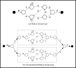

# Embedded Reber Grammar


### About
Provides a script that can be used to generate sequences from Reber Grammar or Embedded Reber Grammar (ERG).
While Reber Grammar is a trivial task for most sequential machine learning models, ERG requires model capabilities for learning long-term dependencies.
The task is less suitable as a benchmark due to the limited number of unique longer sequences that exist within the grammar.
However, it is useful as a sanity check for the development of new model architectures. 

### Usage
Parameter overview:

```
$ python reber.py --help
usage: reber.py [-h] [--num NUM] [--minLen MINLEN] [--maxLen MAXLEN]
                [--seed SEED] [--prediction PREDICTION] [--embedded EMBEDDED]
                [--patience PATIENCE] [--results_dir RESULTS_DIR]

optional arguments:
  -h, --help            show this help message and exit
  --num NUM             number of samples
  --minLen MINLEN       min sequence length
  --maxLen MAXLEN       max sequence length
  --seed SEED           random seed
  --prediction PREDICTION
                        Prediction: shift targets by 1 timestep
  --embedded EMBEDDED   Embedded Reber Grammar or Reber Grammar
  --patience PATIENCE   Script aborts after 'patience' iterations without
                        success of generating a new token
  --results_dir RESULTS_DIR
                        directory for results
```

To generate 250 embedded sequences with length 20:

```
$ python reber.py --num 250 --minLen 20 --maxLen 20 --embedded True 
```

This will generate the following files in data/250_20_20:
- `raw_250_20_20.txt`: Raw sequences as text (txt)
- `token_250_20_20.csv`: Token-wise sequence (csv)
- `x_250_20_20.npy`: Model inputs (1-hot encoding)
- `y_250_20_20.npy`: Model targets (1-hot encoding)

We can also generate sequences of different lengths. In this case, sequences will be 0-padded to the maximum length:

```
$ python reber.py --num 10000 --minLen 10 --maxLen 50 --embedded True 
```

Note that the number of unique sequences is limited for each sequence length, i.e., there are less available sequences for both very short and very long lengths.
If you want to spend more computing resources searching for unique sequences, you can increase `patience` to a value higher than 1Mio (default).

